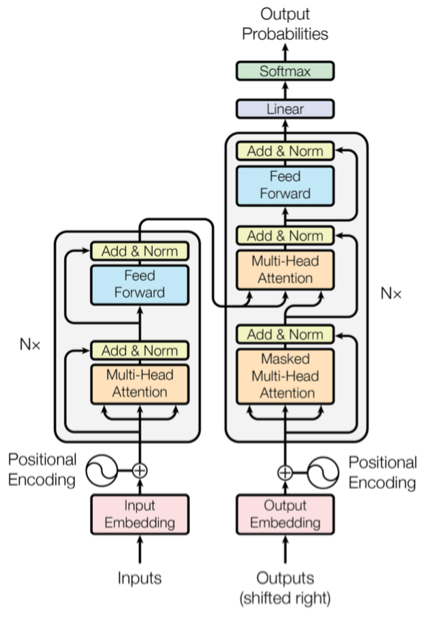
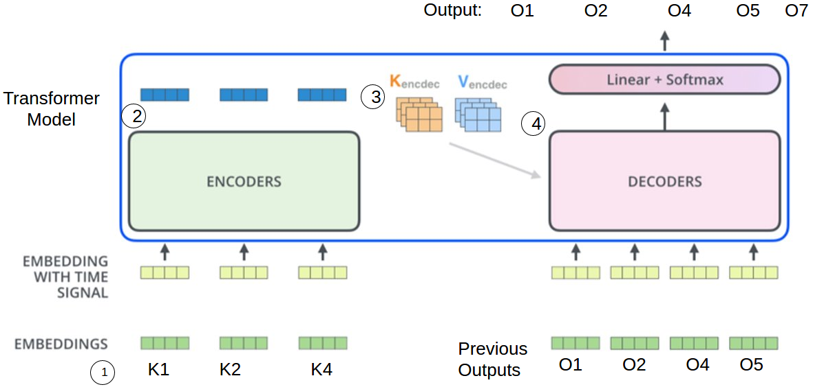
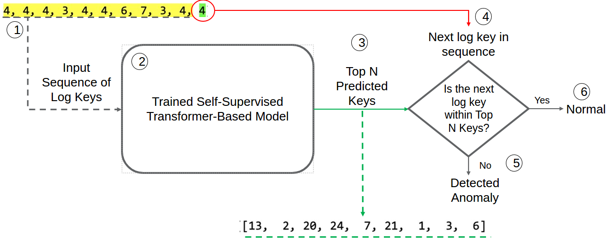

# Anomaly Detection from OS Logs using Transformer
Anomaly detection from logs using Transformers implemented with Pytorch. 

A Pytorch implementation of log anomaly detection model using [Transformer](https://arxiv.org/pdf/1706.03762.pdf). Implementation is divided into Parsing and Anomaly Detection.

## Dataset
Currently, the dataset being used is extracted from an Elastic Search private repository.
However, log datasets can be downloaded from [loghub](https://github.com/logpai/loghub).

## Parser
Parser implementation is based on [Spell](https://www.cs.utah.edu/~lifeifei/papers/spell.pdf) parser used to obtain structured representationg log entries. Actual base implementation can be found on [logparser](https://github.com/logpai/logparser). 

## Anomaly Detection
Anomaly detection is based on unsupervised learning. [Transformer](https://arxiv.org/pdf/1706.03762.pdf)-based models have proven to be effective in language generation. Similarly to generating words or letters, the model learns to generate next log entries. 

The model is trained to learn the normal behavior of log entries, learning to generate normal log entries. 
A log entry is considered an anomaly if next log entry is not within top predicted log entries.

Actual base implementation can be found on [harvardnlp](https://github.com/harvardnlp/annotated-transformer). 

## References

Min Du, Feifei Li. Spell: Online Streaming Parsing of Large Unstructured System Logs. IEEE Transactions on Knowledge and Data Engineering (TKDE), 2018.

Ashish Vaswani, Noam Shazeer, Niki Parmar, Jakob Uszkoreit, Llion Jones, Aidan N. Gomez, Lukasz Kaiser, Illia Polosukhin. Attention Is All You Need.  InAdvances in Neural Information Pro-cessing Systems, 2017.
